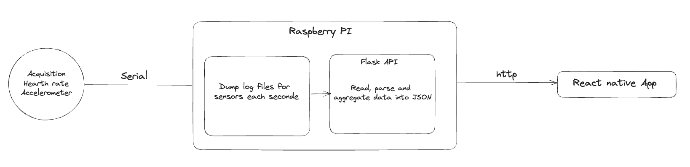

# BFRB Aware

Mobile app as part of TOM France Hackathon 2023 (Team 6)

# Requirements

In order to run an Androïd, the app requires JDK 11 to be ran.

# Installation

- `npm install`

# Running the app

- `npm run android`
- `npm run ios`
- `npm run web`

# State of the app

## React Native App

This repository contains a working React Native app. It displays the status of the user `In crisis` / `Not in crisis`
as well as a list of contact, guidelines and history of crisises.

The application fetches a json wich contains:
- `heartrate`: contains the heartrate value with its associated timestamp
- `position`: contains a `[x,y,z]` vector which contains the movement values with its associated timestamp.

Currently, we are using the heartrate to flag a crisis if there is a difference of more than 10 between two values.

## Technical architecture

# Work to be done

The app currently does not use the `position` values. It could be done to identify the movement of the hand and detect
the crisis more precisely.
